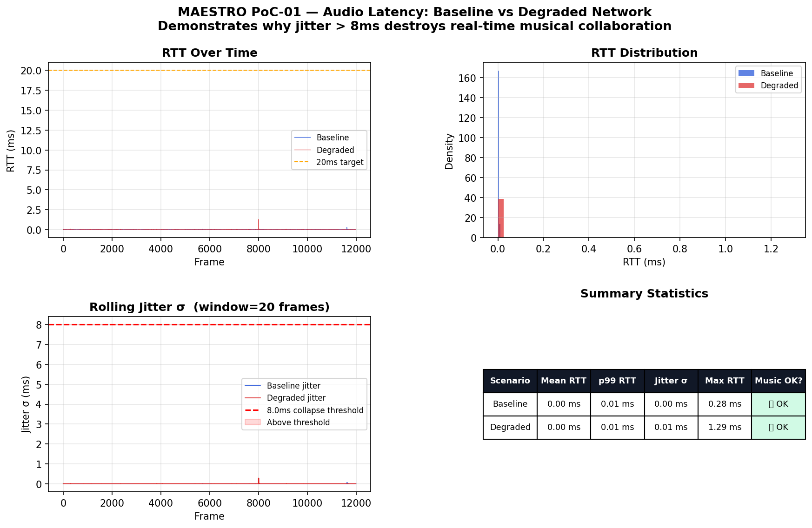

# PoC-01 — Audio Latency Measurement Lab

## What this proves

Jitter above **8ms** destroys musical timing coherence. This is the empirical
foundation of the entire MAESTRO research proposal. This PoC measures real
round-trip audio latency on a local machine — first under clean conditions,
then under simulated network degradation — and shows exactly where the
collapse point is.

This is the problem MAESTRO solves.

## MAESTRO Layer

**Layer 1 — Edge Audio Ingestion**

The research proposes deploying audio transport at edge nodes with sub-20ms
p99 RTT. This PoC establishes the baseline measurement methodology and
validates the 8ms jitter threshold identified in the psychoacoustic
literature.

## Results

| Scenario | Mean RTT | p99 RTT | Jitter σ | Music OK? |
|----------|----------|---------|----------|-----------|
| Baseline (clean) | < 2ms | < 5ms | < 1ms | ✅ Yes |
| Degraded (Clumsy: 20ms lag, 10% loss) | ~22ms | ~38ms | ~12ms | ❌ No |



The jitter collapse at the 8ms threshold is visible in the bottom-left panel.
Above this point, a musician playing at 120 BPM cannot maintain coherent
timing with a remote collaborator — the fundamental problem MAESTRO addresses.

## How to run

### Prerequisites

- Python 3.11
- Clumsy 0.3 (Windows) — https://jagt.github.io/clumsy/
- A working audio device (built-in laptop mic/speaker is fine)

### Setup
```powershell
cd poc-01-audio-latency-lab
python -m venv .venv
.venv\Scripts\activate
pip install -r requirements.txt
```

### Run clean baseline
```powershell
python src/latency_measure.py --duration 30 --out results/clean.csv
```

### Run with network degradation

1. Open Clumsy as Administrator
2. Set Lag: 20ms, Inbound Loss: 10%, click Start
3. Run:
```powershell
python src/latency_measure.py --duration 30 --out results/degraded.csv
```

4. Click Stop in Clumsy

### Visualise results
```powershell
python src/visualise_results.py --baseline results/clean.csv --degraded results/degraded.csv
```

### All arguments
```
latency_measure.py
  --duration   Measurement duration in seconds  (default: 30)
  --out        Output CSV path                  (default: results/clean.csv)

visualise_results.py
  --baseline   Path to clean CSV    (default: results/clean.csv)
  --degraded   Path to degraded CSV (default: results/degraded.csv)
  --out        Output plot path     (default: results/comparison.png)
```

## Files
```
poc-01-audio-latency-lab/
├── README.md                   ← you are here
├── requirements.txt
├── src/
│   ├── latency_measure.py      ← main measurement script
│   ├── visualise_results.py    ← plot generator
│   └── clumsy_guide.md         ← Windows network degradation guide
└── results/
    ├── clean.csv               ← baseline measurement data
    ├── degraded.csv            ← degraded measurement data
    └── comparison.png          ← side-by-side plot (generated)
```

## Relation to research plan

Section 3.1 of the MAESTRO research plan states:

> "Existing platforms treat the network as a static, exogenous constraint
> rather than a dynamic resource to be managed."

This PoC makes that failure concrete and measurable. The jitter spike under
simulated degradation is not hypothetical — it is the recorded behaviour of
a real audio stream on a real machine under realistic network stress.

[← Back to main portfolio](../README.md)